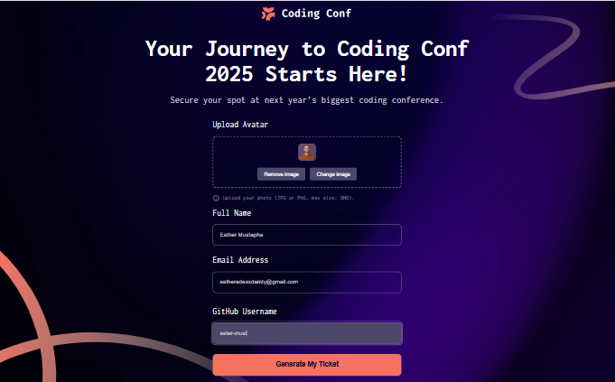
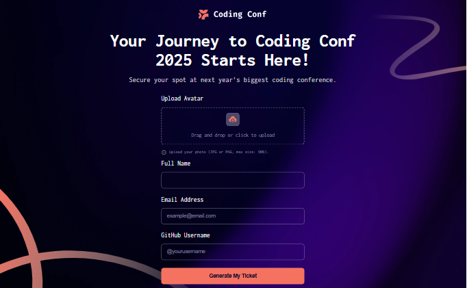
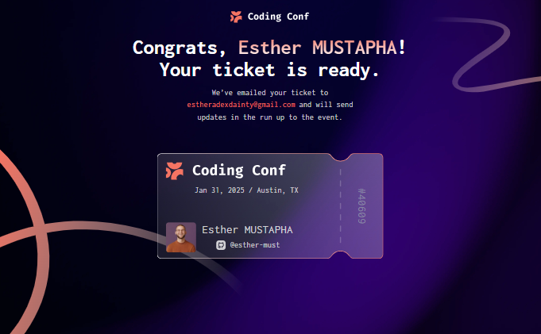
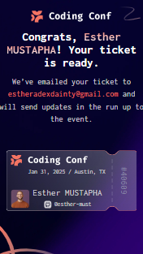
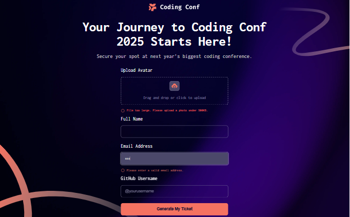
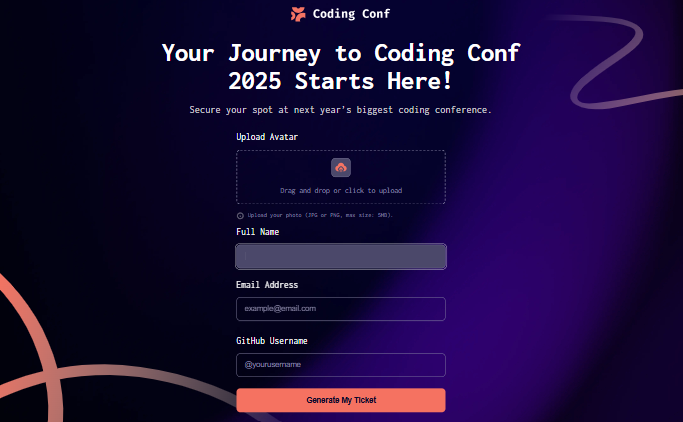

# Frontend Mentor - Conference ticket generator solution

This is a solution to the [Conference ticket generator challenge on Frontend Mentor](https://www.frontendmentor.io/challenges/conference-ticket-generator-oq5gFIU12w). Frontend Mentor challenges help you improve your coding skills by building realistic projects. 

## Table of contents

- [Overview](#overview)
  - [The challenge](#the-challenge)
  - [Screenshot](#screenshot)
  - [Links](#links)
- [My process](#my-process)
  - [Built with](#built-with)
  - [Continued development](#continued-development)
  - [Useful resources](#useful-resources)
- [Author](#author)
- [Acknowledgments](#acknowledgments)

## Overview

### The challenge

Users should be able to:

- Complete the form with their details
- Receive form validation messages if:
  - Any field is missed
  - The email address is not formatted correctly
  - The avatar upload is too big or the wrong image format
- Complete the form only using their keyboard
- Have inputs, form field hints, and error messages announced on their screen reader
- See the generated conference ticket when they successfully submit the form
- View the optimal layout for the interface depending on their device's screen size
- See hover and focus states for all interactive elements on the page

### Screenshot

### Links

- Live Site URL: (https://esther-ticket-generator.netlify.app/)

## My process

### Built with

- Semantic HTML5 markup
- CSS custom properties
- Flexbox
- Mobile-first workflow
- Javascript
- [Styled Components](https://styled-components.com/) - For styles

### Continued development

In future projects, I plan to:

- Dive deeper into advanced CSS techniques such as animations and transitions.
- Explore improving screen reader support with ARIA roles.
- Integrate backend functionality for real-time ticket generation.

### Useful resources

- [CSS-Tricks](https://css-tricks.com/) - For responsive design tips.
- [The Markdown Guide](https://www.markdownguide.org/) - For writing this README.

## Author

- Website - [Esther AJAYI](https://esthercoders.netlify.app)
- Frontend Mentor - [@esther-must](https://www.frontendmentor.io/profile/esther-must)
- Twitter - [@adexdainty92](https://x.com/adexdainty92)

## Acknowledgments

Thanks to Frontend Mentor for the opportunity to work on this project. A special shout-out to the community for inspiration and helpful resources during the development process.
